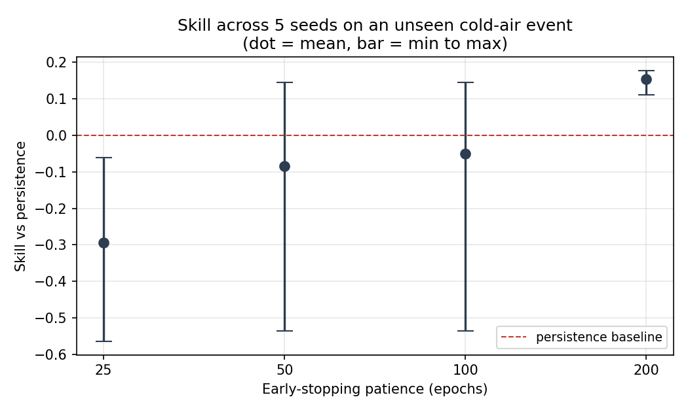

# Thermal Station Forecasting — When a Neural Net Barely Beats a Baseline

Can a small neural network predict the next temperature reading of a real
thermal station better than simply repeating the last reading?

Short answer: **yes, by about 15% on an event it never saw — but only after
three traps were found and removed.** This repository documents the traps as
much as the result.



---

## 1. The question

- **Input:** the last 15 readings of the inside temperature (30 s at Ts = 2 s)
- **Target:** the next reading
- **Success criterion, fixed before any network was trained:** lower RMSE
  than the best simple baseline, on data the network never saw, repeatable
  across random seeds

---

## 2. Data

One logging session from a DHT22 / ESP32 station: 2 359 samples at 2.000 s,
zero timing jitter (~79 minutes).

**Disturbances applied by hand during the session:**

| Type | Count | Effect on `t_in` |
|---|---|---|
| Hand hold | 3 | slow rise to 34–35 °C |
| Hot glass | 2 | fast rise to 38–39 °C |
| Cold air | 3 | drop to 25–28 °C |

**Cleaning decisions:**

- Missing values were logged as `-99`, not `NaN`, so `isna()` reported zero.
  The inside sensor had 3 disconnection blocks of exactly 29 samples each;
  they became segment boundaries rather than being interpolated. The first
  reading after each reconnection was also dropped (non-representative in the
  two cases where it could be measured).
- **Humidity dropped:** saturated at 99.9 % in 211 samples during both hand
  and glass events, slower than temperature, and driven by the disturbance
  method rather than by the station.
- **Outside temperature dropped:** 92 % of samples sit on two values; its
  changes are quantization steps, not signal.
- **Normalization:** standardization with statistics from the training set
  only, applied unchanged to validation.

---

## 3. Baselines first

Three baselines, none of which learn anything:

| Baseline | Train RMSE (°C) | Static-validation RMSE (°C) |
|---|---|---|
| Persistence (repeat last value) | 0.082 | **0.040** |
| Window mean | 0.508 | 0.047 |
| Linear extrapolation | **0.074** | 0.067 |

The best baseline changes with the data: extrapolation wins where there is
real motion, persistence wins where the signal is flat.

---

## 4. The static-validation trap

The first split used the session's last three segments as validation. They
contained **no events** — only slow room drift, 1/10 of the training range.

- Persistence scored 0.040 °C, **below one quantization step (0.1 °C)**.
- The best network reached 0.046 °C.
- Any "win" on this set would have been inside sensor noise.

**Fix:** validation must contain an event of a type the network has seen,
but an instance it has not. The last cold-air event (rows 1655–1892) became
validation, with a 15-sample gap from training and freshly computed
normalization. Persistence on this event: **0.0595 °C**.

---

## 5. Seeds and patience

Network: 15 → 3 (ReLU, He) → 1 (linear), 52 parameters, Adam, MSE, batch 45.

**Trap 2 — one seed.** Seed 0 gave +14.1 % skill. Five seeds gave:

| Seed | 0 | 1 | 2 | 3 | 4 |
|---|---|---|---|---|---|
| Skill | +0.14 | −0.15 | +0.05 | +0.09 | −0.44 |

Mean **−0.06**. The first result was the best of five.

**Trap 3 — impatient early stopping.** Curves showed two seeds overshooting
their minimum, so early stopping was the indicated fix. With patience 50 it
made things *worse* (mean −0.085): three seeds had a long plateau early and
their true minimum was after epoch 800.

Instead of guessing, full 1 000-epoch validation curves were recorded once
per seed and early stopping was **simulated** on them for every patience:

| Patience | 25 | 50 | 100 | 200 |
|---|---|---|---|---|
| Mean skill | −0.294 | −0.085 | −0.050 | **+0.153** |

A real run with patience 200 reproduced it: mean **+0.155**, all five seeds
positive (+0.111 to +0.177).

---

## 6. Result

| Model | RMSE on unseen cold-air event (°C) |
|---|---|
| Persistence | 0.0595 |
| Network, 5 seeds | 0.049 – 0.053 |

The saved model (`.keras`) ships with a `meta.json` holding the
normalization constants, window length, sample period and validity range,
because a model fed raw temperatures returns a wrong number silently.

---

## 7. What the physics model can and cannot do

A second-order thermal model was identified earlier on the same data
(`notebooks/01_system_identification.ipynb`):

    T(t) = A1·exp(−t / 21.0 s) + A2·exp(−t / 236.3 s) + C

Both time constants were fixed on three events and validated on five others,
including cold air, a type unseen in the fit.

- **As a descriptive model** it is excellent: 0.048 °C on the same cold-air
  event, with residual sign changes (42 of ~74 expected) close to noise.
- **As a one-step forecaster it fails:** 4.08, 5.56 and 1.59 °C RMSE across
  three set-ups, with residuals that never change sign. It has no input for
  the disturbance, and a 30 s window cannot pin down a 236 s time constant.

So the physics model and the network cannot yet be compared on the same task.
That comparison needs an input-driven model, which needs a controlled heater.

---

## 8. Limitations

- **One validation event**, of one type.
- **Early stopping monitored the same set used for evaluation**, so the
  reported skill is somewhat optimistic. A separate test event is needed.
- **The margin is 0.011 °C**, one tenth of the sensor's quantization step.
- **No linear-regression baseline** on the 15-sample window was tried; it may
  close much of the gap.
- **One session, hand-made disturbances, no heater.** The model has never
  seen the dynamics it would face in closed-loop control.

---

## Repository

```
data/thermal_log.csv
notebooks/01_system_identification.ipynb
notebooks/02_forecasting.ipynb
figures/model_validation.png
figures/patience.png
```
